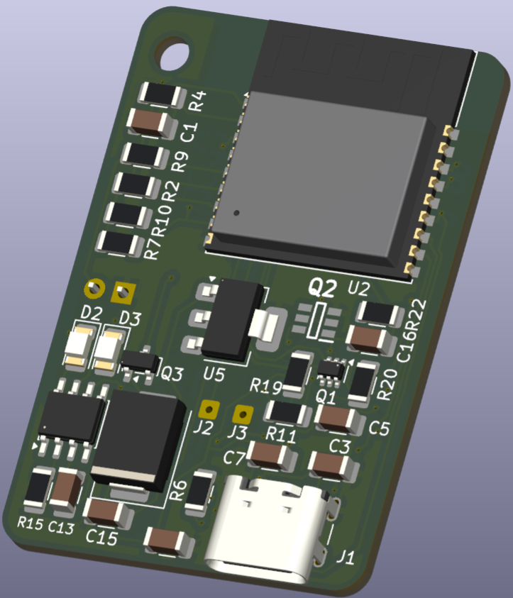
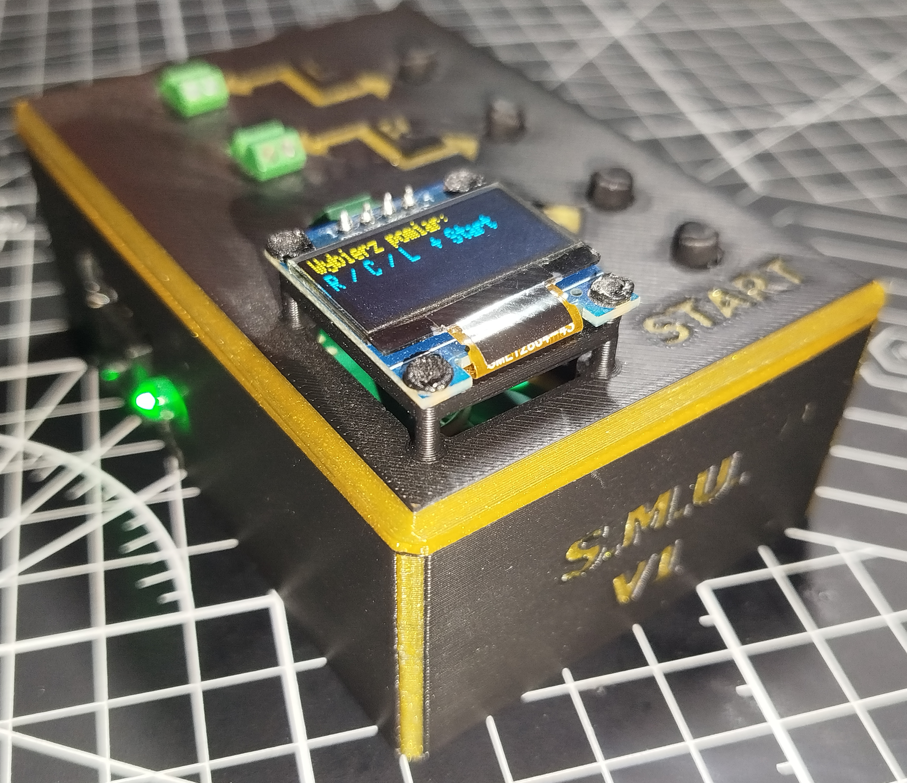
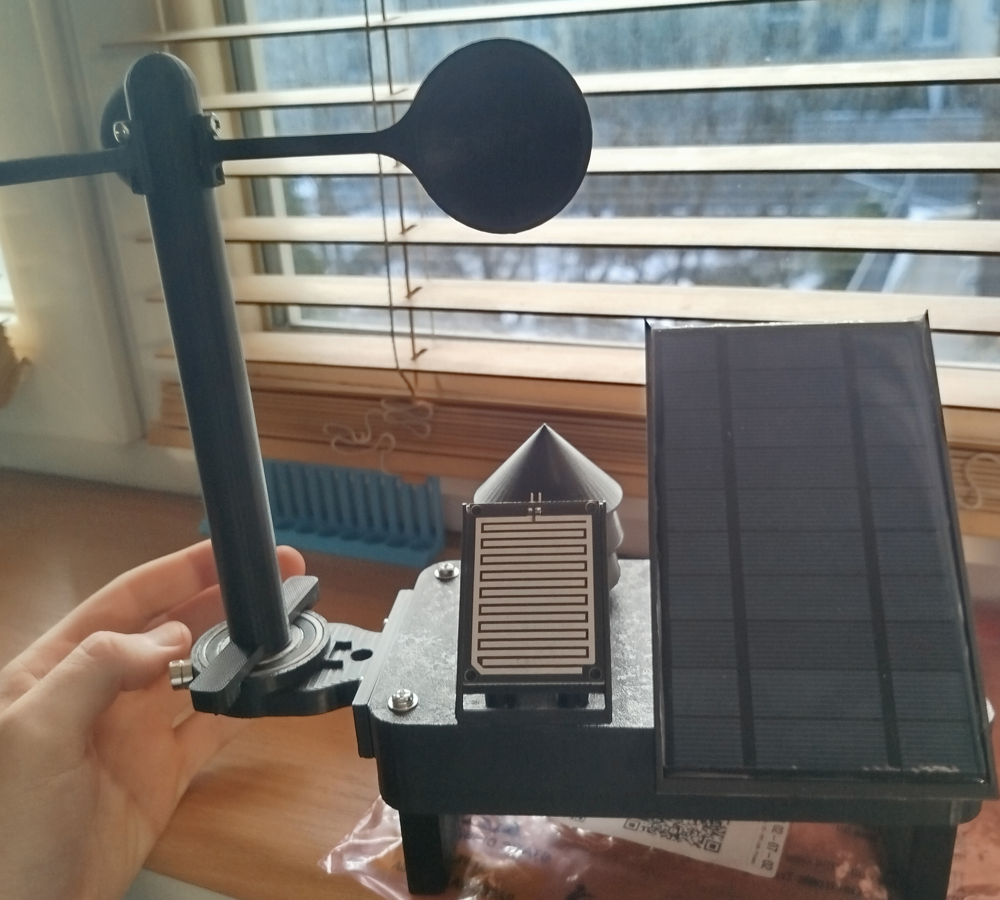
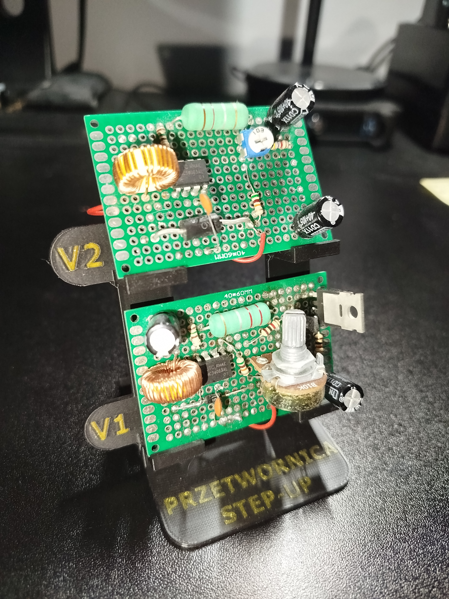
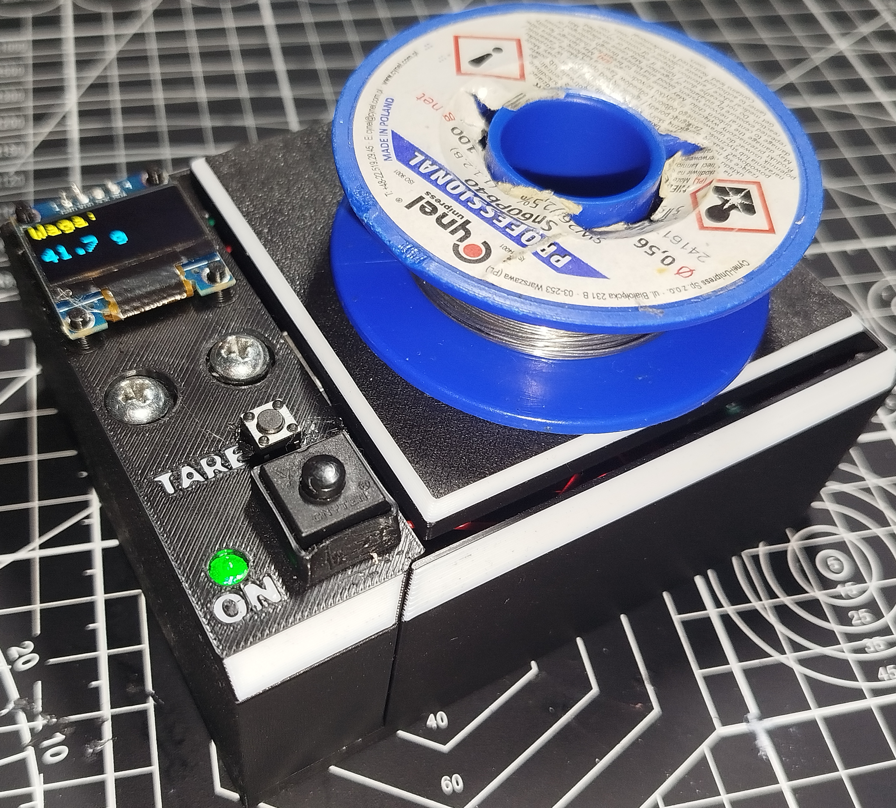
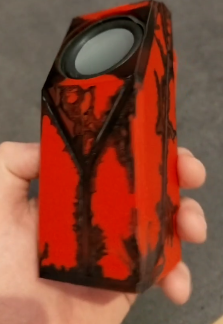
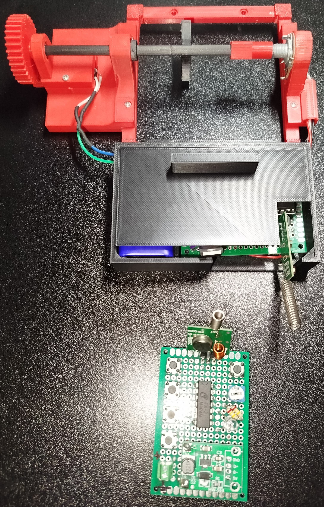

---

# Selected Projects

## 6-DOF Manipulator – Engineering Thesis

  

### Project description

Design and construction of an anthropomorphic robotic manipulator with six degrees of freedom.

The project included development of the kinematic model, mechanical structure, custom control electronics, embedded software and validation of the complete prototype.

I developed the forward and inverse kinematics, mechanical design requirements, control electronics and motion-control software. The finished prototype was also tested in terms of repeatability, positioning accuracy and motion quality.

### Technologies

`ESP32` `C/C++` `Forward kinematics` `Inverse kinematics` `Stepper motors` `DRV8825` `PCB design` `CAD` `3D printing` `Prototype testing`

### Status 🟢 Completed prototype

---

## Modular Laboratory Power Supply

  

### Project description

A compact adjustable laboratory power supply developed as the first module of a larger modular electronics workstation.

The project combines power electronics with a custom mechanical enclosure designed for convenient bench use. The current power-supply module has been designed and completed as a standalone device.

Planned future modules include a **symmetrical voltage source** and **signal generator**, extending the completed power supply into a larger modular laboratory station.

### Technologies

`Power electronics` `DC/DC conversion` `CAD` `3D printing` `Mechanical design` `Prototyping` `Laboratory equipment`

### Status 🟢 Completed

The laboratory power-supply module is complete.
Future development may expand the platform with additional laboratory instruments.

---

## Clickfy – BLE Multimedia Remote

  

### Project description

A compact keychain-sized multimedia remote based on the ESP32-C3 and Bluetooth Low Energy HID.

The device provides dedicated controls for basic media functions such as play/pause, next track and previous track.

I designed the custom PCB, selected the electronic components and developed the firmware responsible for BLE communication, battery monitoring and low-power operation.

The final device integrates the electronics, battery and physical controls into a compact portable enclosure and operates as a standard BLE multimedia controller with compatible phones and computers.

### Technologies

`ESP32-C3` `C/C++` `ESP-IDF` `Bluetooth Low Energy` `BLE HID` `Li-Po battery` `ADC battery monitoring` `PCB design` `Low-power operation`

### Status 🟢 Completed and functional

A working hardware prototype and firmware have been completed and tested.
The device successfully operates as a BLE multimedia remote.

---

## S.M.U. – RLC Component Meter

  

### Project description

S.M.U. is a custom electronic meter designed for measuring resistance, capacitance and inductance.

Different measurement methods are used depending on the selected component type.

Resistance is determined using voltage-divider measurements with reference resistors.
Capacitance is measured using the RC time constant.
Inductance is measured by exciting an LC circuit and analyzing its oscillation frequency.

I developed the measurement algorithms, designed the PCB, prepared the firmware and designed the enclosure of the device.

### Technologies

`Raspberry Pi Pico` `C/C++` `ADC` `Comparator` `RC measurements` `LC resonance` `Analog electronics` `PCB design` `Measurements` `3D printing`

### Status 🟢 Completed prototype

---

## ESP32 Solar Weather Station

  

### Project description

An autonomous environmental monitoring station powered by a battery and photovoltaic panel.

The station collects environmental measurements and sends them wirelessly to a receiver, where the results can be presented through a local web interface.

The project combines sensor integration, wireless communication, photovoltaic power and low-power operation.

I designed the electronics using commercial modules and developed the software responsible for collecting, transmitting and displaying measurement data.

### Technologies

`ESP32` `ESP-NOW` `BME280` `Environmental sensors` `Solar power supply` `Li-Ion` `WebServer` `Low-power operation`

### Status 🟢 Completed prototype

---

## Suntracker – Solar Tracking Powerbank

  

### Project description

The system uses a microcontroller to measure electrical parameters of the photovoltaic source and control motorized positioning of the panel in search of a more favorable operating point.

The project also included experiments with **Maximum Power Point Tracking (MPPT)** and became an important step toward more advanced solar power-management projects.

Experience gained during development of Suntracker was later used in the development of the newer **Solarbank** project, where the focus shifted toward a more compact custom power-management PCB and microcontroller-controlled charging system.

### Technologies

`STM32` `Photovoltaics` `MPPT` `INA219` `Motor control` `Servo control` `DC motors` `Power electronics` `PCB design`

### Status 🟢 Completed theoretical prototype

[Open repository](https://github.com/Wudker/Suntracker)

---

# Work in Progress

The following projects are currently under active development.

---

## Hot_dog – Quadruped Robot

### Project description

A quadruped robotic platform being developed as part of my master's thesis.

The project focuses on the design of a lightweight walking robot with independently controlled legs and a custom parallel leg mechanism.

Development includes mechanical design, inverse kinematics, servo control and validation of individual leg prototypes before and during integration into a complete four-legged platform.

The project is currently progressing from individual leg testing toward coordinated four-leg movement and gait development.

### Technologies

`ESP32` `C/C++` `Inverse kinematics` `Servo control` `Robotics` `Parallel mechanisms` `CAD` `3D printing` `Mechanical prototyping`

### Status 🟡 Work in progress

A functional leg mechanism and first full-body prototype have been developed.
Current work focuses on multi-leg coordination, gait generation, mechanical refinement and motion control.

[Open repository](https://github.com/Wudker/Hot_dog)

---

## Solarbank – Solar Power Bank

  

### Project description

A solar-powered power bank combining photovoltaic energy harvesting, battery charging, power conversion and embedded control on a custom PCB.

The system is designed around an STM32 microcontroller responsible for supervising the power-management process, including photovoltaic input monitoring, battery state estimation and control of charging parameters.

The hardware includes dedicated power-conversion stages for the solar input, battery system and regulated USB output.

One of the main development goals is implementation of microcontroller-assisted MPPT control to improve utilization of the connected photovoltaic panel.

The project builds on experience gained during development of the earlier **Suntracker** project, while moving toward a significantly more integrated and compact electronic design.

### Technologies

`STM32U031` `C/C++` `STM32CubeMX` `Power electronics` `MPPT` `Li-Ion battery` `Battery management` `DC/DC converters` `KiCad` `Custom PCB`

### Status 🟡 Work in progress

The schematic and PCB layout have been developed through several design iterations.
Firmware development, PCB manufacturing and hardware validation form the next stages of the project.

[Open repository](https://github.com/Wudker/Solarbank)

---

## SmartRoom – MQTT Room Automation System

### Project description

A modular room-automation platform based on network-connected embedded controllers.

The system uses ESP32 devices communicating through MQTT with a local broker, creating a common communication layer for different sensors and actuators.

The first implemented controller manages multiple addressable LED installations. Lighting zones can be controlled independently, including brightness, color and lighting effects.

The firmware includes automatic Wi-Fi and MQTT reconnection as well as device availability reporting.

The project is intended to gradually integrate lighting, environmental monitoring and other room devices into one local automation platform.

### Technologies

`ESP32` `C++` `MQTT` `Wi-Fi` `PlatformIO` `Addressable LEDs` `IoT` `Home automation` `CAD` `3D printing`

### Status 🟡 Work in progress

The first lighting-control system is functional and communicates with a local MQTT broker.
Further embedded controllers and integration with the EVA assistant are under development.

[Open repository](https://github.com/Wudker/SmartRoom)

---

# Additional Projects

The projects below include smaller prototypes, experiments and earlier engineering exercises that contributed to the development of my practical electronics, software and mechanical-design skills.

---

## MC34063 Boost Converter

  

Educational prototype of a custom boost converter based on the MC34063 integrated circuit.

The project focused on understanding switching converter operation, component selection, efficiency and the practical limitations of older power-converter architectures.

`MC34063` `Power electronics` `Switching converters` `Measurements` `Prototyping`

**Status:** 🟢 Completed prototype

---

## Electronic Measuring Scale

  

Electronic scale based on a strain-gauge load cell and measurement electronics.

The project included signal acquisition, conversion of sensor readings into mass values, basic calibration and stability testing.

`Strain gauge` `ADC` `Analog measurements` `Calibration` `Signal filtering` `C/C++`

**Status:** 🟢  Completed

[Open repository](https://github.com/Wudker/Scale)

---

## Scrapper – Voice Mini AI Assistant

  

A small Raspberry Pi based voice-assistant prototype integrating a MEMS microphone, audio output and external API services.

The system records a spoken query, processes it using external services and plays back a synthesized voice response.

The project also became an early practical experiment that later influenced the development of the more advanced **EVA** assistant concept.

`Raspberry Pi` `Python` `MEMS microphone` `Audio` `API integration` `Speech synthesis`

**Status:** 🟢 Completed prototype

---

## Room Automation Prototype Based on RX-2B / TX-2B

  

An experimental room-automation prototype using RX-2B and TX-2B remote-control integrated circuits.

The project investigated whether inexpensive radio-control chips could be reused as a simple multi-channel home-automation platform.

A working remote-control unit and lighting actuator were built. The experiment also demonstrated the practical advantages of Wi-Fi based microcontrollers for more advanced automation systems and contributed to the later development of SmartRoom.

`RX-2B` `TX-2B` `Control electronics` `Remote control` `Prototyping` `Home automation`

**Status:** 🟢 Experimental prototype completed

## Modular Cabinet System

A modular storage and furniture concept designed in Autodesk Inventor.

The system is based on interchangeable CAD-designed modules that can be combined into different configurations.

`Autodesk Inventor` `CAD` `Mechanical design` `Modular design`
**Status:** 🟢  Completed

[Open repository](https://github.com/Wudker/Modular_cabinet)

---

# Early-Stage Development

## EVA – Everyday Virtual Assistant

A voice-assistant platform intended to integrate natural voice interaction with locally controlled embedded devices.

The planned architecture combines Raspberry Pi computers for audio processing and higher-level logic with MQTT communication to the SmartRoom ecosystem.

`Raspberry Pi` `Python` `MQTT` `Voice interaction` `IoT` `AI integration`

[Open repository](https://github.com/Wudker/EVA)

---

# Main Areas of Interest

* Embedded systems
* Robotics
* Mechatronics
* PCB design
* Power electronics
* Prototype development
* Measurement systems
* Low-power devices
* IoT and wireless communication
* CAD and mechanical design
* 3D printing
