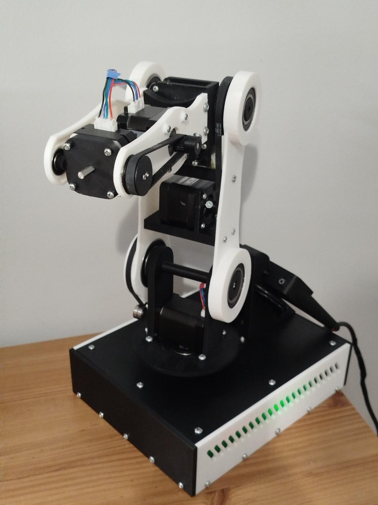
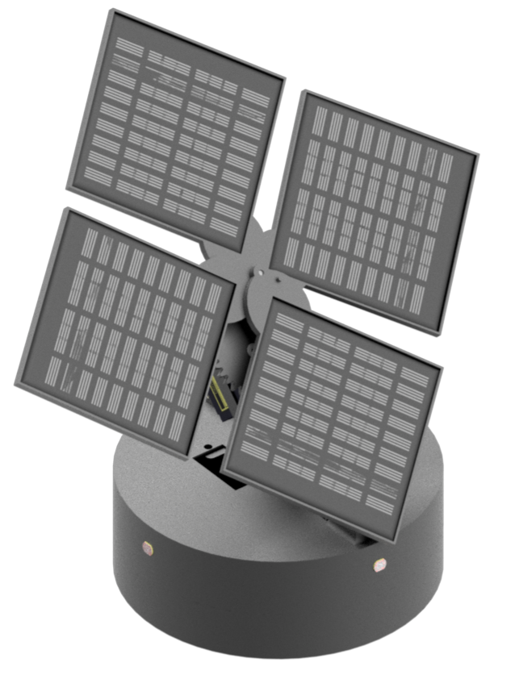

Mechatronics engineer focused on embedded systems, robotics, PCB design and low-power electronic devices.

I build complete prototypes: from mechanical design and electronics, through firmware, to testing and documentation.

  
  
  

  <a href="Portfolio_EN.pdf"><b>Open full portfolio PDF</b></a>

